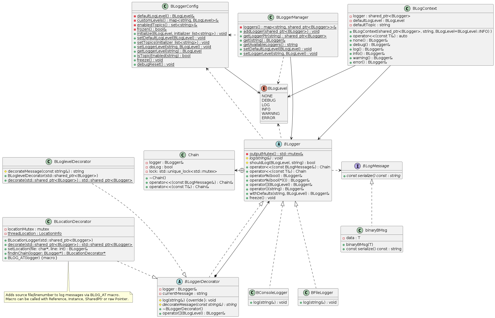

[](https://badges.pufler.dev)

# BLogger
Small Project for learning/configuring and getting used to nvim and my new NVim Config. 

The Goal was to have a project that is a little bit more complex than the default "Hello World" Stuff and forces me to use some more advanced `concepts` in nvim, including managing the git-workflow, makefile auto-creation etc.
Still I wanted to have something usefull/reusable, so I decided on a small C++-Logger.

It should be a Header-Only Logger with support for:
- [ ] File-Logging
    - [x] Basic File-Logging
    - [ ] Customizable Logpath
    - [ ] Log-Rotation
    - [x] Platform-Indepentent
- [x] Console-Logging
- [ ] Composite-Logging (Console+File in one)
- [x] Threadsafety
- [x] Topic-based Logging and filtering
- [x] Level-based Logging and filtering
- [x] Conditional Logging
- [x] Logging custom "Classes/Messages" 
- [x] Flexible way of configuring/customizing the Logged Message
    - [x] Easily expandable via Decorators
- [x] Out of the Box support for basic Logger-Functionabilities
    - [x] Log Location of log-Statement
    - [x] Log Timestamp
    - [ ] Log Username
- [x] Central Management and Distribution of all Loggers
    - [x] Overall setting of Loglevel possible
    - [x] Custom Loglevel per Loggerinstance still possible
- [ ] Ideally maintainable and easily and intuitively usable, but out of experience.... :-) 


## The (Rough) Class-Architecture of BLogger



## Usage - EXEMPLARY Workflows
Some of these usecases are generated using ChatGPT and the tests/test.ipp as a base. These could be incorrect even though i looked them over, but should at least provide a rough understanding of the intended usecases and improvement-possibilites.

A full working implementation of most (maybe if i was carefull all - not highly likely) of the usecases can be found in said test.ipp file.

### Creating a simple BLogger used in multiple files
```cpp
// create a new Logger with the name "console" once in the main()
// Of course the Logger can be created directly in addLogger as a shared ptr
BLogger *consoleLogger = new BConsoleLogger("console");
BLoggerManager::addLogger(std::shared_ptr<BLogger>(consoleLogger));
// Logger can be accessed locally
*consoleLogger << "Hello World via local reference";
// or from any other File by getting the reference from the Manager
// Import Manager und start using it
BLoggerManager::get("console") << "Hello World via statically stored reference";

// A list of the available Loggers in the Manager can be seen using this
std::string availableLoggers = BLoggerManager::getAvailableLoggers();
```

### Customizing logged Message
```cpp
std::shared_ptr<BLogger> lg = BLoggerManager::getLoggerPtr("console");
*lg << "Undecorated";
// availabe decorators can be found in include/logger/decorators/*
// all can be used like this, but BLocationDecorator has other prerequisits (see section BLocationDecorator)
lg = BTimestampDecorator::decorate(lg);
*lg << "Decorated with a Timestamp";
// Changing the Decorator using 
```

### Log Location using BLocationDecorator
```cpp
// Alternative way to create a consoleLogger
auto baseLogger = std::make_shared<BConsoleLogger>("console");
auto decoratedLogger = BLocationDecorator::decorate(baseLogger);
// Use the decorator via the BLOG_AT Macro to add the location 
BLOG_AT(decoratedLogger) << "Location-Decorated logentry";
```

### Log-Levels
```cpp

BLoggerConfig::setDefaultLogLevel(BLogLevel::INFO);
// Progression is NONE<DEBUG<LOG<INFO<WARNGING<ERROR
(*logger)[BLogLevel::DEBUG] << "Will not be shown";     // filtered out
(*logger)[BLogLevel::ERROR] << "This will be shown";

// Setting a custom level to our registered decorator (with name=console)
BLoggerConfig::setLoggerLevel("console", BLogLevel::DEBUG);
(*logger)[BLogLevel::DEBUG] << "Now visible (custom level set)";
```

### Log-Topics
```cpp
BLoggerConfig::setTopics({"network", "io"});

(*logger)("network")[BLogLevel::INFO] << "Network log";
(*logger)("security")[BLogLevel::INFO] << "Will not be shown (filtered by topic)";
```

### Conditional Logging
```cpp
bool doLog = (condition == true);
(*console)[BLogLevel::INFO] % doLog << "Will only log if condition is true";
```

### Using a local BLogContext for easier reuse
```cpp
BLogContext context(fullyDecorated, "memory", BLogLevel::WARNING);
context << "Low memory warning";
context.info() << "Additional info";
context.raw()[BLogLevel::DEBUG] << "Raw message with original Decorator";
```

### Freezing configurations
```cpp
BLoggerConfig::freeze();
try {
    BLoggerConfig::setTopics({"should_fail"});
} catch(const std::runtime_error&) {
    *consoleLogger << "Config is frozen – can't change topics anymore!";
}
```

### Implementing own Message (or let BLogger log own class)
```cpp
// Inheriting from BLogMessage and overwriting "serialize" to make it logable
class MyMSG : public BLogMessage {
    const std::string serialize() const override {
        return "MY_DONE_STUFF_WITH_THE_CLASS";
    }
};
```

### Implementing own Decorator to change the output of Messages
```cpp
// Inheriting from BLoggerDecorator and 
class MyDecorator : public BLoggerDecorator {
    protected:
        inline std::string decorateMessage(const std::string& msg) override {

            return ("[" + "MY_STUFF" + "] " + msg);
        }

    public:
        static std::shared_ptr<BLogger> decorate(std::shared_ptr<BLogger> logger) {
            if(logger == nullptr)
                throw std::invalid_argument("Logger cannot be null");
            return std::make_shared<MyDecorator>(std::move(logger));
        }
};

// Usage
auto customLogger = MyDecorator::decorate(logger);
*customLogger << "Logged with custom prefix";
```
